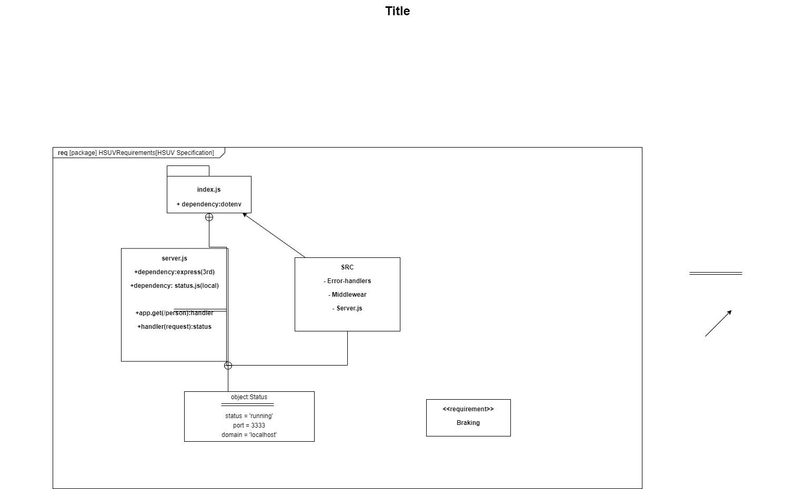

# LAB - Class 5

## Project: basic-express-server

### Author: Arthur Lozano Jr

### Links and Resources

- [AWW](https://awwapp.com/?dis=%5B%5B%22close-menus%22%5D%5D#) (AWW board)
- [front-end application](https://dashboard.heroku.com/apps/basic-express-server-lab2/deploy/github) (Heroku)
- [Jest](https://jestjs.io/) (Jest)
- [ci/cd](https://github.com/Arthur-Lozano/lab-02/actions) (GitHub Actions)
- [Pull Request] (https://github.com/Arthur-Lozano/lab-02/pull/3) 

### Setup

#### `.env` requirements (where applicable)
- `PORT` - 3333

#### How to initialize/run your application (where applicable)

- npm start
- `nodemon`

#### How to use your library (where applicable)

#### Tests
* 404 on a bad route
* 404 on a bad method
* 500 if no name in the query string
* 200 if the name is in the query string
* given an name in the query string, the output object is correct

#### UML

